# Hardware used
## Raspberry Pi
The [Raspberry Pi 3 Model B](https://www.raspberrypi.com/products/raspberry-pi-3-model-b/) is a relatively cheap, but capabable compute module which is powerfull enough to deploy firmware from [Github actions](https://github.com/features/actions) on the target. It is out of the box supported by the [Github action runner](https://github.com/actions/runner).

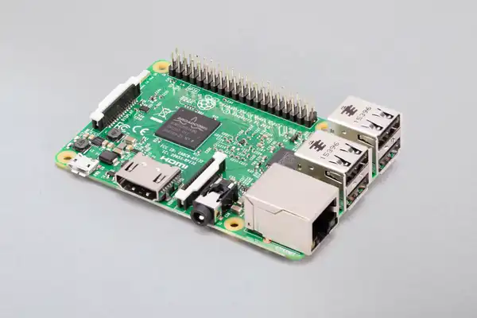

## STM32 NUCLEO Board
The [STM32 NUCLEO](https://www.st.com/en/evaluation-tools/stm32-nucleo-boards.html) series of boards cover a wide range of 32 bit ARM core based MCU's. Devices are divided in the categories: mainstream, ultra low power and high performace. They offer many different perpherals, flash sizes and pin counts.
The [NUCLEO-F303K8](https://www.st.com/en/evaluation-tools/nucleo-f303k8.html) used here is near the lower end. It has a small footprint and its connectors are Arduino Nano compatible. Because the NUCLEAO boards all contain an embedded ST-LINK they support source level debugging with breakpoints and stepping through the code.

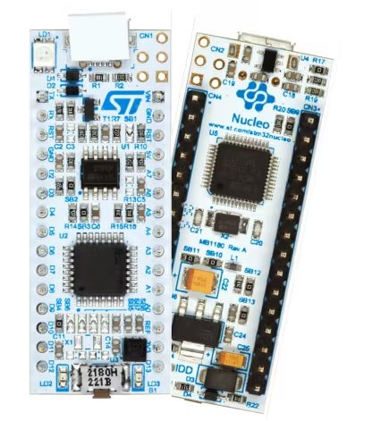

# Fork the workshop repository
Fork the [xanderhendriks/rpi-embedded-target-action-runner](https://github.com/xanderhendriks/rpi-embedded-target-action-runner) repository:

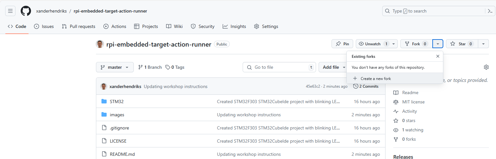

And clone your fork to get a local copy:

`git clone git@github.com:<your_github_username>/rpi-embedded-target-action-runner.git`

# Working with the STM32CubeIde project
Start the [STM32CubeIde](https://www.st.com/en/development-tools/stm32cubeide.html) and select a directory to use as workspace:

## Importing the project
And import the project from application directory:

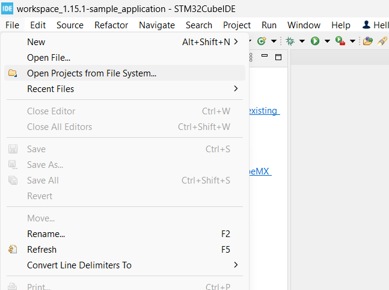

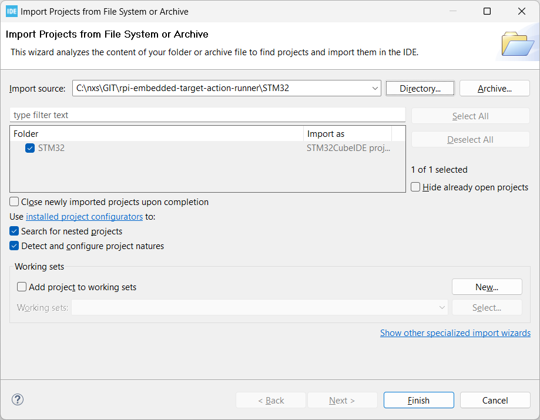

## Build the project
Press the build button and check the ouput in the cosole window at the bottom:

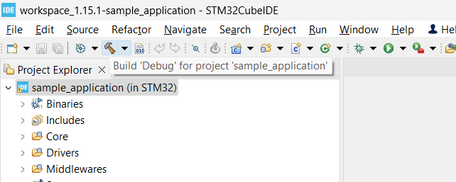

## Run the code in the debugger
To run the code on the target connect the USB cable, press the debug button and select **Debug Configurations...**

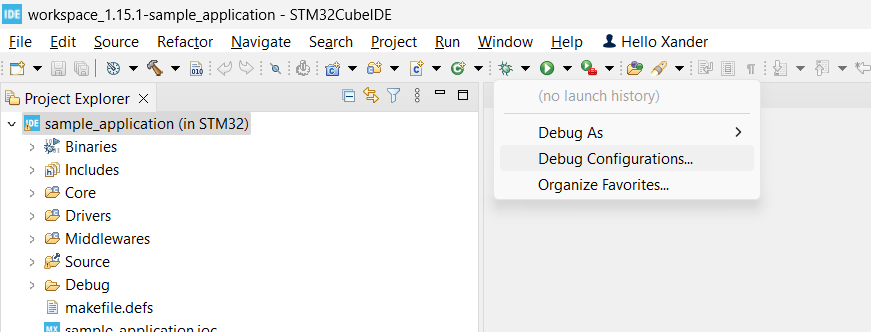

In the following dialog select the **sample_application Debug** and press the **Debug** button.

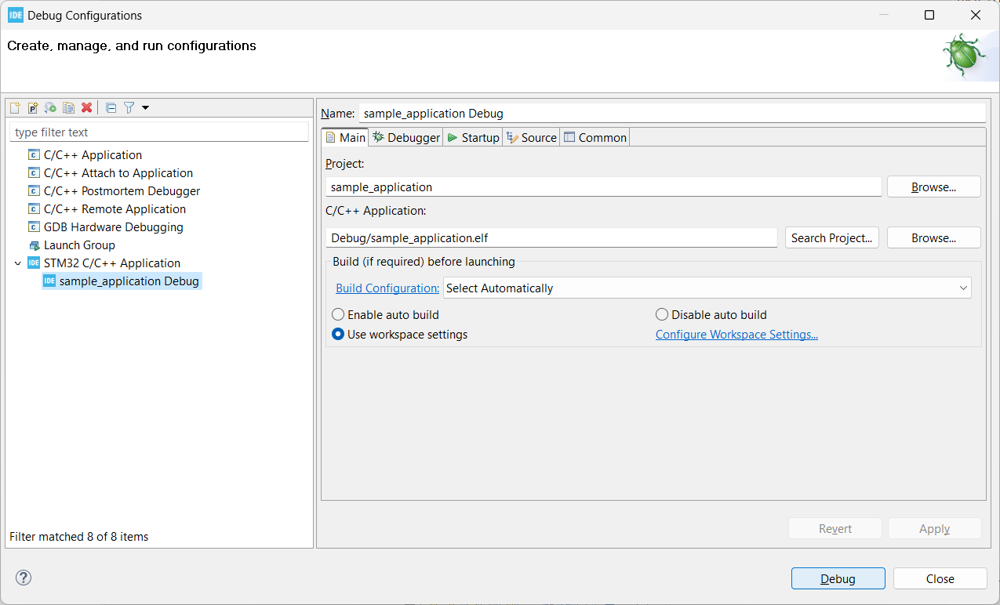

The IDE will take some time to process and when it's done it will stop at the first line of the main function. Before pressing the play button start a terminal program like [Tera Term](teraterm.md).

Once this has all been setup press the play button (green triangle) in the IDE. Check that the green LED on the NUCLEO board is blinking once a second and look at the output on the terminal. What is the version of the code?

## Release versioning
Projects will have different requirements for version numbering. The convention used in this workshop makes a clear distinction between official releases in the cloud on the master branch, releasing of the code on a branch and locally build images.

### Official release on master branch
When a build is done on the master branch the minor version number will be incremented for the build resulting in 0.1.0, 0.20, etc. The resulting binary will be renamed to show the version number sample_application-0.1.0.bin

### Branch build
A branch build has to be kicked off manually if it needs to be released. Otherwise it will only be build as part of the PR, but not released. The version will be set to 0.0.0 to indicate a branch build and the github commit is shown to indicate the 'version'. The name of the file will be sample_application-d44fd2fe0e-dev.bin

### Local builds
When a developer builds the code on his system the version is set 0.0.0 and the githash to **debugbuild**. As these builds could rely upon the individual configuration of the developer's sytem, these builds should never make it out into the field. The name of the binary is the default from the IDE: sample_application.bin

## IDE version information handling
In order to make sure that the firmware can report the correct version it needs to be given the version details as part of the build. In this project this is done with the [application/makefile.defs](application/makefile.defs). This file links environment variables ENV_VERSION_XXX to MAKE_VERSION_XXX, which in the IDE are presented with the defines VERSION_XXX through the Paths and Symbols dialog:

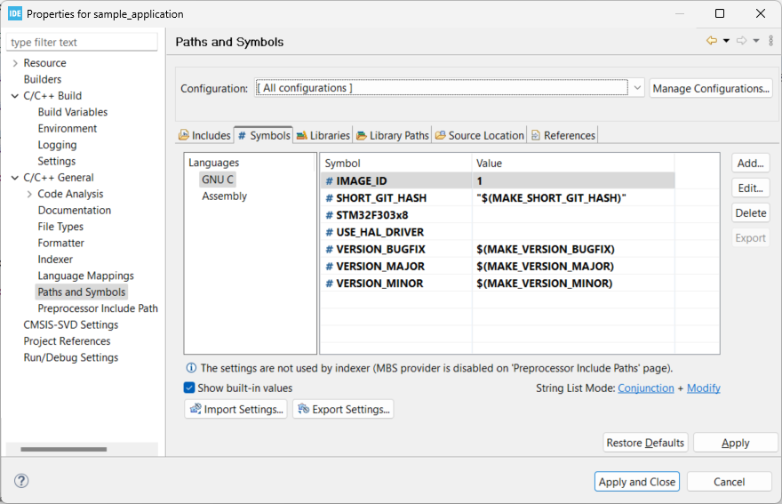

# Github action for building code
Create a file called .github/workflows/ci_pipeline.yml and add the following pipeline name:

    name: Continuous integration pipeline

Configure when to run the action. For now we'll start with all pushes to the master branch:

    on:
    push:
        branches:
        - master

Add the jobs entry and define the **build-sample-application** job and name it **Build**. This is the name that will show on the webpage. Keep the name short as long names get abbreviated. We'll run the action on an ubuntu-22.04 cloud runner:

    jobs:
    build-sample-application:
        name: Build
        runs-on: ubuntu-22.04

The first step in the pipeline is cloning the repo:

    steps:
      - name: Checkout the repository
        uses: actions/checkout@v4.1.7

Then there are a number of steps which implement the versioning as described in [Release versioning](#release-versioning):

    - name: Determine short GIT hash
      id: short-sha
      run: |
        echo "sha=$(echo ${{github.sha}} | sed 's/^\(.\{10\}\).*$/\1/')" >> $GITHUB_OUTPUT
    - name: Bump version
      if: github.ref == 'refs/heads/master'
      id: tag_version
      uses: mathieudutour/github-tag-action@v6.2
      with:
        github_token: ${{ secrets.GITHUB_TOKEN }}
        dry_run: true
        default_bump: minor
        fetch_all_tags: true
    - name: Version handling
      id: version_handling
      run: |
        # Use the bumped version when on master or otherwise 0.0.0
        if [ -z ${{ steps.tag_version.outputs.new_tag }} ]
        then
          version=0.0.0
          file_postfix=${{ steps.short-sha.outputs.sha }}-dev
        else
          version=${{ steps.tag_version.outputs.new_version }}
          file_postfix=$version
        fi
        echo "version=$version" >> $GITHUB_OUTPUT
        echo "file_postfix=$file_postfix" >> $GITHUB_OUTPUT
        echo "major=$(echo $version | sed 's/\([0-9]*\)\.\([0-9]*\)\.\([0-9]*\).*/\1/')" >> $GITHUB_OUTPUT
        echo "minor=$(echo $version | sed 's/\([0-9]*\)\.\([0-9]*\)\.\([0-9]*\).*/\2/')" >> $GITHUB_OUTPUT
        echo "bugfix=$(echo $version | sed 's/\([0-9]*\)\.\([0-9]*\)\.\([0-9]*\).*/\3/')" >> $GITHUB_OUTPUT

Now finally comes the actual building of the code in the cloud. It uses the code which was cloned in the previous steps and sets the environment variables to get the correct version information in the binary:

    - name: Build the sample_application binary
      uses: xanderhendriks/action-build-stm32cubeide@v12.0
      with:
        project-path: 'application'
        project-target: 'sample_application'
      env:
        ENV_VERSION_MAJOR: ${{ steps.version_handling.outputs.major }}
        ENV_VERSION_MINOR: ${{ steps.version_handling.outputs.minor }}
        ENV_VERSION_BUGFIX: ${{ steps.version_handling.outputs.bugfix }}
        ENV_SHORT_GIT_HASH: ${{ steps.short-sha.outputs.sha }}

To enable sharing different versions of the binary the output files are renamed, so they will contain the version information:

    - name: Rename and copy files
      run: |
        mkdir stm32-firmware
        cp application/Release/sample_application.bin stm32-firmware/sample_application-${{ steps.version_handling.outputs.file_postfix }}.bin
        cp application/Release/sample_application.elf stm32-firmware/sample_application-${{ steps.version_handling.outputs.file_postfix }}.elf
        cp application/Release/sample_application.list stm32-firmware/sample_application-${{ steps.version_handling.outputs.file_postfix }}.list
        cp application/Release/sample_application.map stm32-firmware/sample_application-${{ steps.version_handling.outputs.file_postfix }}.map

And finally the files are uploaded to Github to allow them to be used in other jobs:

    - name: Upload sample_application artifacts
      uses: actions/upload-artifact@v4.3.3
      with:
        name: stm32-firmware-sample_application-${{ steps.version_handling.outputs.file_postfix }}
        path: stm32-firmware

Commit and push the changes and check the execution of the action in github. It should look like this:

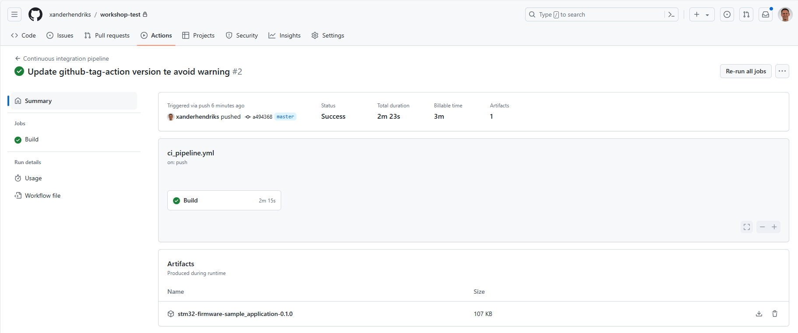

## Build artifacts
Download the articact from the **stm32-firmware-sample_application-0.1.0** link at the bottom of the page. The donloaded zip contains the following files:
- sample_application-0.1.0.bin: Binary file which can be deployed to the target
- sample_application-0.1.0.elf: Binary file including symbols. Used for the debugger.
- sample_application-0.1.0.list: Linker output showing the assembly code resulting from the compiler
- sample_application-0.1.0.map: Linker output showing the memory locations for all symbols in the code

Unzip the sample_application-0.1.0.bin and copy it to the thumbdrive which is implemented by the ST-LINK on the NUCLEO board. You should see the application green application LED stop blinking and the green LED next to the USB connector blink green/red for a couple of seconds.
After the green/red blinking has stopped the green application LED will start blinking again. The NUCLEO is now running the code which was build in the cloud. Looks at the serial terminal and notice how it is now showing **image_id: 1, version: 0.1.0-57ba8d2ac5** instead of the **image_id: 1, version: 0.0.0-debugbuild** from the local execution.

## Creating a github release
The build artifacts and logs are only kept for 90 days. So if we would want to keep the artifacts we need to create a release.

For this we create the release job. It starts with downloading the artifacts from the build job, followed by some code to get the version number from the filename. The third and final step creates the github release and uploads the artifacts:

    release:
      needs: [build-sample-application]
      if: github.ref == 'refs/heads/master'
      name: Release to Github
      runs-on: ubuntu-22.04
      steps:
        - name: Download artifacts
          uses: actions/download-artifact@v4.1.7
          with:
            path: stm32-firmware
        - name: Determine version
          id: determine_version
          run: |
            if [ -n "$(find stm32-firmware -name 'stm32-firmware-sample_application-*-dev')" ]
            then
                version=0.0.0
                file_postfix=$(find stm32-firmware -name "stm32-firmware-sample_application-*" | sed 's/stm32-firmware\/stm32-firmware-sample_application-\(.*\)/\1/')
            else
                version=$(find stm32-firmware -name "stm32-firmware-sample_application-*" | sed 's/stm32-firmware\/stm32-firmware-sample_application-\([0-9\.]*\)/\1/')
                file_postfix=$version
            fi
            echo "version=$version" >> $GITHUB_OUTPUT
            echo "file_postfix=$file_postfix" >> $GITHUB_OUTPUT
        - name: Release to Github
          id: create_release
          uses: ncipollo/release-action@v1.14.0
          with:
            token: ${{ secrets.GITHUB_TOKEN }}
            tag: v${{ steps.determine_version.outputs.file_postfix }}
            name: v${{ steps.determine_version.outputs.file_postfix }}
            commit: ${{ github.sha }}
            draft: false
            prerelease: false
            artifacts: "stm32-firmware/stm32-firmware-*/*"

Commit and push the changes. Check the output in Github actions. The build fails because by default actions are not allowed to write to the repo. You should also have received an email indicating the failed build. To fix this go to the repo's settings: **Settings -> Actions -> General**

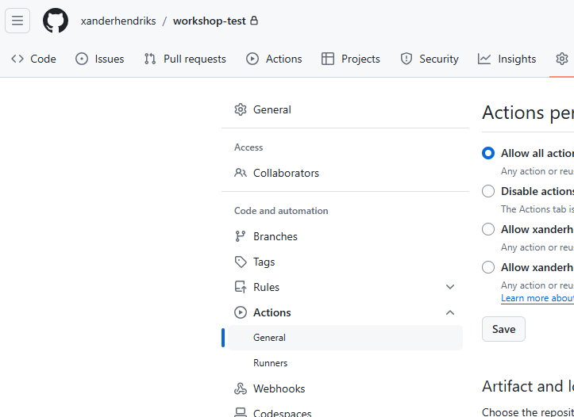

And set the workflow permissions to **Read and write permissions**

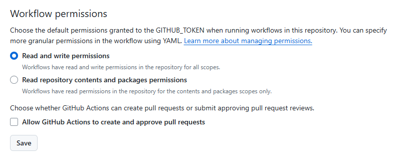

Go back to the failed action, press the **Re-run jobs** button and select **Re-run failed jobs**. This option will keep the build results and only retry the Release to Github job. This feature is often used when test on the target don't always produce fully reproducable results.

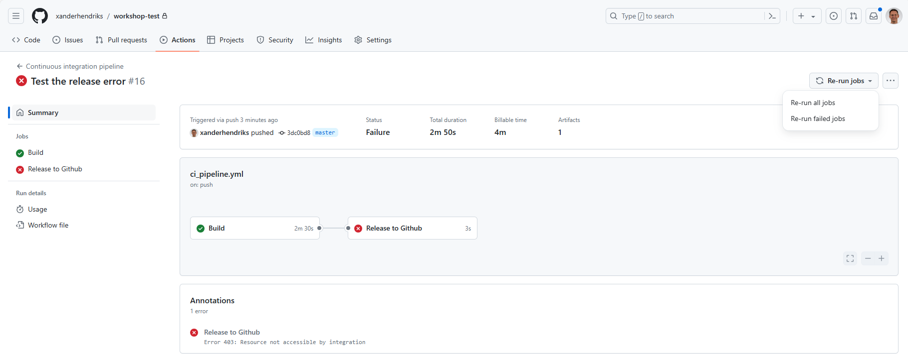

## Build output
Check the ouput of the sample application build step and scroll down to the warning:

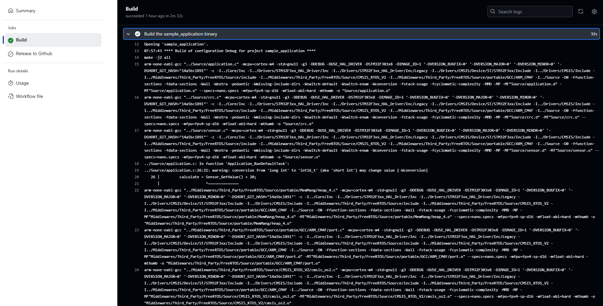

This warning is actually causing an error in the output value, which means our first release has got a bug in it. For this reason an engineering best practice is to always to get the compiler to treat all warnings as errors. When doing this new warnings always need to be resolved right away and can't cause bugs down the road.

To do this for our source code open the properties dialog by right clicking on the **source directory**. It is important to do this configuration of our own sources as doing this for the whole project will generate errors for the STM32 provided code.

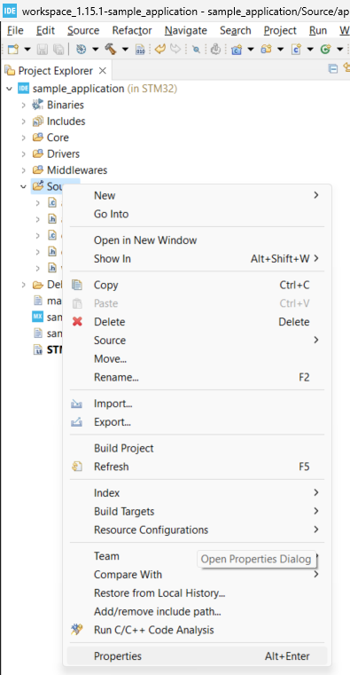

In the Properties Dialog set the MCU GCC Compiler Warnings as indicated in the following screenshot. Make sure to select **[ All configurations ]**:

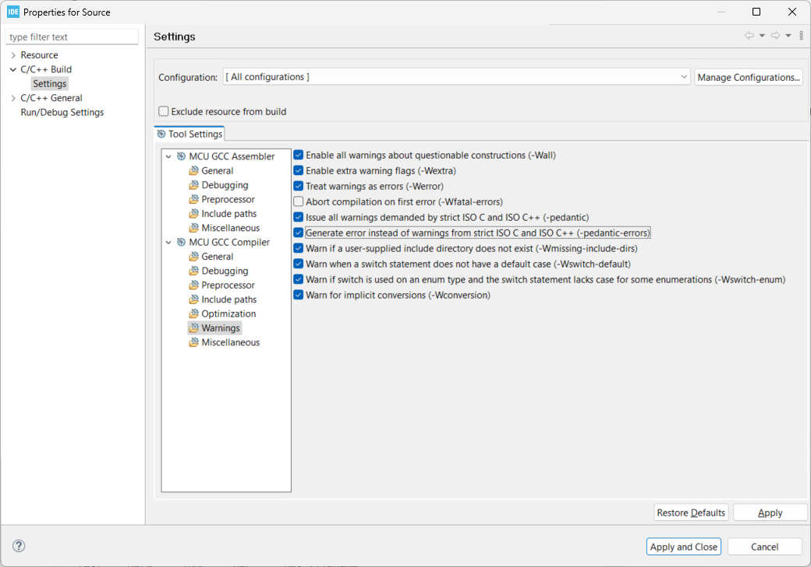

Commit and push the changes to Github. Check the Action execution.

The action failed. We have now implemented our first level of testing and are using the compiler to filter out any dubious constructs in the code.

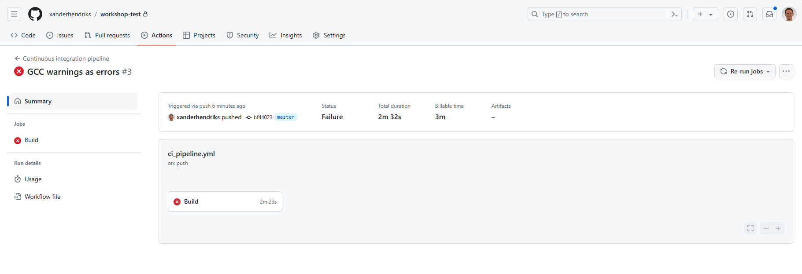

The error can still be ignored for a specific instance by adding pragmas to tell the compiler it should ignore the error. Modify the code like this:

		if (runCalculation)
		{
	#pragma GCC diagnostic push
	#pragma GCC diagnostic ignored "-Wconversion"

			calculate = Sensor_GetValue() + 20;

	#pragma GCC diagnostic pop

			printf("Calculated value: %hd\n", calculate);
		}

Commit the code and push the changes and check that the build is passing again. It's best practice to rewrite the code and make it pass. The pragmas can just be convenient for special constructs which are hard to rewrite.

In this particular case the pragma is now hiding a bug. Remove the pragma and fix the code. Hint: the **Calculated value: 19** in the serial output is incorrect.
Commit and push the changes to make the build pass again.
Download the binary and see if you get the expected value in the serial output

## Run the pipeline for Pull Requests
Another best practice is to use pull requests to allow changes on branches to be reviewed before being merged into the master branch. To make sure the code passes the static analysis and can be build, the code on the PR can be told to run the ci pipeline by **adding pull_request** to **on** parameter for the pipeline:

    on:
      push:
        branches:
          - master
      pull_request:

The **if: github.ref == 'refs/heads/master'** line in the release job makes sure that no release is created for Pull Request builds.

## Branch builds
In some cases it is desirable to evaluate a new feature or bug fixe without having to merge the code into master for a release. This is where branch releases come in.

Add a **workflow_dispatch** to the **on** parameter to create a button for branch builds:

    on:
      push:
        branches:
          - master
      pull_request:
      workflow_dispatch:
        inputs:
          release:
            description: 'Release (y/n)?'
            required: true
            default: 'y'

The **Release (y/n)?** question allows to select if a release should be created for the branch build. It defaults to **y**. To allow the **n** option to work the run condition for the release job needs to be updated from: if: **github.ref == 'refs/heads/master'** to **if: github.ref == 'refs/heads/master' || github.event.inputs.release == 'y'** as follows:

    release:
      needs: [build-docs, build-sample_application]
      if: github.ref == 'refs/heads/master' || github.event.inputs.release == 'y'
      name: Release to Github
      runs-on: ubuntu-20.04
      steps:

To manually run the pipeline on your branch go to the actions page and press the **Run workflow** button:

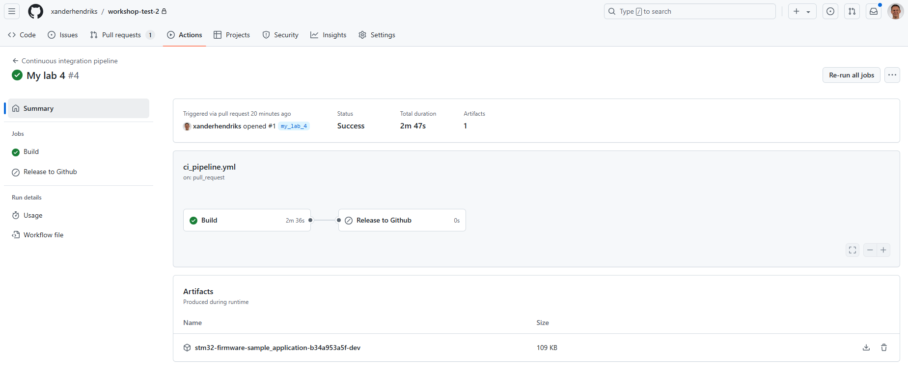

# Setup the Github action runner on the RPi
## Preparing the SD Card
The SD Card for this project was created using the Windows version of the [Raspberry Pi Imager](https://www.raspberrypi.com/software/). On the first page of the tool select which RPi version to create an image for, Which image to use and which SD Card to write it to. Here we are using an RPi3 and the Raspberry OS Lite (Legacy, 64-bit):

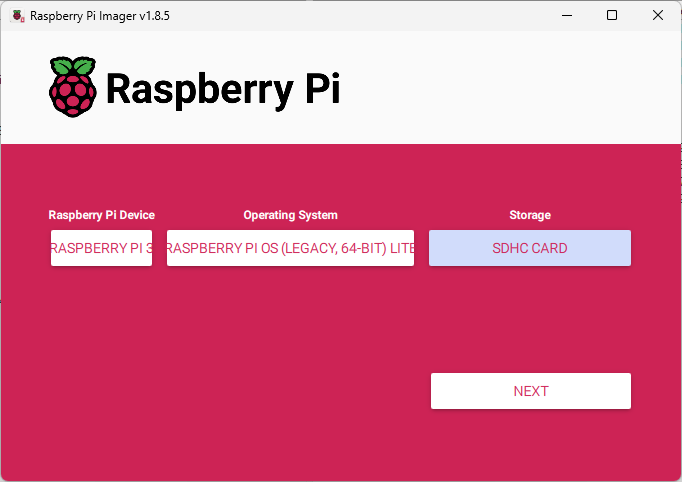

Here is a clearer image of the image selection, as it is important to select the Bullseye legacy image. In the latest image the openocd tool can't be configured to the working, 0.11.0~rc2-1, version.

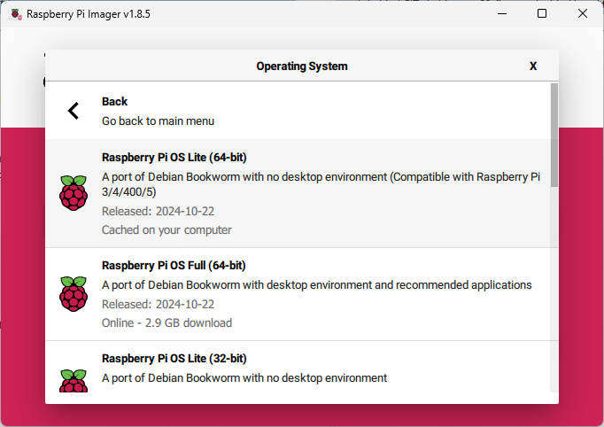

In the second dialog some inital setup of the RPi can be configured. It is good practice to use a unique hostname here, so it will be easy to access the device without having to use a monitor and keyboard. The dialog also allows the wireless network details to be given and a configuration of the timezone the device will be operating in.

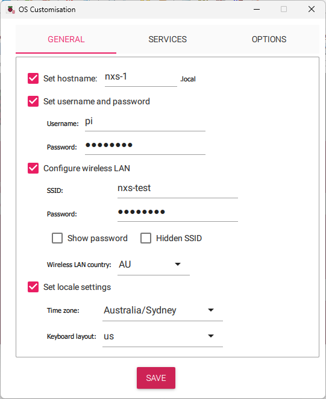

The final dialog is left to default to enable the SSH out of the box for headless use:

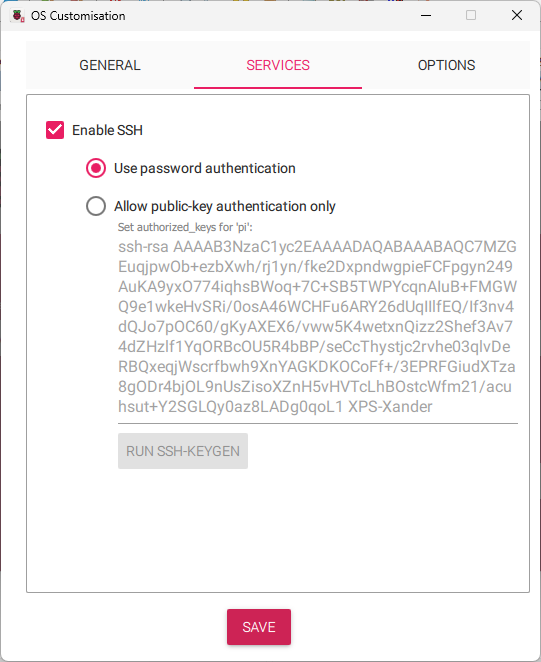

# Prepare RPi action runner
login to the RPi using ssh:

`ssh pi@nxs-1`

After starting the RPi for the first time it is good practice to run the update and upgrade commands to make sure that the latest (security) updates are installed for the OS:
`sudo apt update ; sudo apt upgrade -y`

Install openocd which is used for programming the NUCLEO board:
`sudo apt install openocd=0.11.0~rc2-1`

NOTE that when `sudo apt upgrade` is run again that the openocd package will be upgraded to a later version which fails during flash write on the STM32 MCU. If this happens just run the above command again to downgrade the openocd to the 0.11.0~rc2-1 again.

