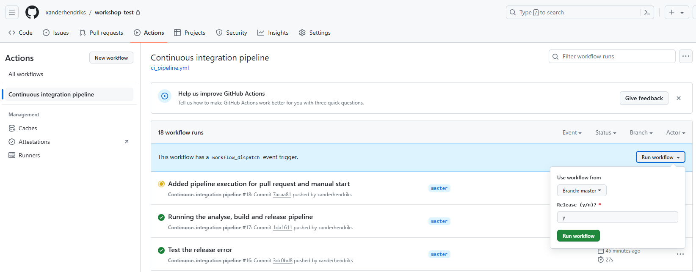

# Ensuring Product Reliability
The main goal of this workshop is to show some ways that could assist in making sure that shipped products are of sufficient quality to delight customers. Both from an electronics and firmware perspective. The approach to achieve this consists of two key components.

## Firmware verification
First there is the firmware that implements the product's functionality. Bugs in the firmware will affect every product running this code and will greatly affect how the end user perceives the product. Both in a positive and a negative way. Nowadays with iterative ways of working it is possible to release more features in a shorter time. Delivering a pipeline of constant improvements to the product for the customer through over the air (OTA) updates. The downside of this is that it has become impossible to spend a lot of time testing every release, as this would mean spending more time on testing than on writing code. Luckily there are a lot of tools available today that can be used to automate this process. We will look at how Github actions can be used to build firmware images in the cloud in a reliable and reproducible manner. And how a Raspberry Pi (RPi) can be used as a remote action runner to verify the functionality of every firmware build in a fully automated way.

### Different types of testing
During firmware development different types of testing can be identified. Some of them are very easy to implement and can be run in an automated manner. Meaning that with a minimal amount of effort these tests can be run on any change of the code. Resulting in a higher confidence that the code willl work as designed.

#### Compiler
It may sound silly, but the compiler can be part of the testing regime. Most modern compilers generate warnings on code which may not do what the developer intended. By enabling the feature to treat all warnings as errors, these kind of bugs can be avoided.

#### Static analysis
Similar to the compiler, another suite of tools that can help reducing potential bugs are static analysis tools. They check the code and point out code constructs that are know to cause bugs during maintenance of the code. As an often heard quote says: "Code is written once, but read many times". We better make sure the person who has to modify the code after us can understand what we have done. It may even just be our future self 3 months down the track.

[Wikipidea](https://en.wikipedia.org/wiki/List_of_tools_for_static_code_analysis) has a good list of available tools. Both free and paid.

#### Unit testing
In unit testing you take a single source file and check its functionality by calling its functions with different parameters to see if they give the expected result. This can also be a great help for development as it is a lot easier to check corner cases that can't easily be tested in the real product. Think of a temperature sensor giving back a negative reading. In the unit test the call to external modules need to be 'mocked'. In the case of the temperature sensor you would write a new function which replaces the sesnor's read function. This new function would be created as such that it would return a set of know values to be consumed by the test.

[Wikipidea](https://en.wikipedia.org/wiki/List_of_unit_testing_frameworks) has a good list of available tools. Most of them are free to use.

#### Integration testing
Integration testing is often overlooked, while it is actually a very powerful way of testing the code. You combine a small set of source files together and build them into a mini application for a very specific purpose. This could for instance be to verify the time it takes for a safety feature to detect a problem and bring the system in a safe state. Or testing the throughput of the code controlling a certain interface to see if it consistently meeds the speed requirements for the system.

#### System testing
For the system test we need to be able to verify that all it's interfaces are working as expected. This is typically done as a black box test where without knowlegde of the code the external interfaces are monitored and controlled. This can be done in different ways. You could hook up hardware that mimics the communication of sensors and actuators or you could have the real hardware with some extra hardware around it which can be controlled or monitored from the system test.

## Final acceptance test
Having firmware that is going to be a big hit with the customer is only half the picture. If the hardware is not working properly the end result will still be a dissatisfied user. To avoid this every product has to be tested before it is packed and shipped. This is often done with expensive test equipment which uses a customised bed of nails to probe all the important signals on the board. Something that is not cost effective for an early stage startup until product market fit has been reached and the product is being manufactured in larger batch sizes. We will explore a cost effective test environment utilising an RPi running a Flask server with a simple React based UI.

The code for the workshop for this part can be found in github repository: [xanderhendriks/rpi-final-acceptance-test](https://github.com/xanderhendriks/rpi-final-acceptance-test).

# Hardware used
## Raspberry Pi
The [Raspberry Pi 3 Model B](https://www.raspberrypi.com/products/raspberry-pi-3-model-b/) is a relatively cheap, but capabable compute module which is powerfull enough to deploy firmware from [Github actions](https://github.com/features/actions) on the target. It is out of the box supported by the [Github action runner](https://github.com/actions/runner).

## STM32 NUCLEO Board
The [STM32 NUCLEO](https://www.st.com/en/evaluation-tools/stm32-nucleo-boards.html) series of boards cover a wide range of 32 bit ARM core based MCU's. Devices are divided in the categories: mainstream, ultra low power and high performace. They offer many different perpherals, flash sizes and pin counts.
The [NUCLEO-F303K8](https://www.st.com/en/evaluation-tools/nucleo-f303k8.html) used here is near the lower end. It has a small footprint and its connectors are Arduino Nano compatible. Because the NUCLEAO boards all contain an embedded ST-LINK they support source level debugging with breakpoints and stepping through the code.

# Software used
Install the following software locally:
- [STM32CubeIDE 1.15.1](https://www.st.com/en/development-tools/stm32cubeide.html)
- [TeraTerm 5.2](https://github.com/TeraTermProject/teraterm/releases) (Or other terminal program)
- [Docker](https://www.docker.com/products/docker-desktop/)

# Accounts used
- [Github](https://github.com/)

# Fork the workshop repository
Fork the [xanderhendriks/rpi-embedded-target-action-runner](https://github.com/xanderhendriks/rpi-embedded-target-action-runner) repository:

And clone your fork to get a local copy:

`git clone https://github.com/<your_github_username>/rpi-embedded-target-action-runner.git`

# Working with the STM32CubeIde project
Start the [STM32CubeIde](https://www.st.com/en/development-tools/stm32cubeide.html) and select a directory to use as workspace:

## Importing the project
And import the project from application directory:

## Build the project
Press the build button and check the ouput in the cosole window at the bottom:

## Run the code in the debugger
To run the code on the target connect the USB cable, press the debug button and select **Debug Configurations...**

In the following dialog select the **sample_application Debug** and press the **Debug** button.

The IDE will take some time to process and when it's done it will stop at the first line of the main function. Before pressing the play button start a terminal program like [Tera Term](teraterm.md).

Once this has all been setup press the play button (green triangle) in the IDE. Check that the green LED on the NUCLEO board is blinking once a second and look at the output on the terminal. What is the version of the code?

## Release versioning
Projects will have different requirements for version numbering. The convention used in this workshop makes a clear distinction between official releases in the cloud on the master branch, releasing of the code on a branch and locally build images.

### Official release on master branch
When a build is done on the master branch the minor version number will be incremented for the build resulting in 0.1.0, 0.20, etc. The resulting binary will be renamed to show the version number sample_application-0.1.0.bin

### Branch build
A branch build has to be kicked off manually if it needs to be released. Otherwise it will only be build as part of the PR, but not released. The version will be set to 0.0.0 to indicate a branch build and the github commit is shown to indicate the 'version'. The name of the file will be sample_application-d44fd2fe0e-dev.bin

### Local builds
When a developer builds the code on his system the version is set 0.0.0 and the githash to **debugbuild**. As these builds could rely upon the individual configuration of the developer's sytem, these builds should never make it out into the field. The name of the binary is the default from the IDE: sample_application.bin

## IDE version information handling
In order to make sure that the firmware can report the correct version it needs to be given the version details as part of the build. In this project this is done with the [application/makefile.defs](application/makefile.defs). This file links environment variables ENV_VERSION_XXX to MAKE_VERSION_XXX, which in the IDE are presented with the defines VERSION_XXX through the Paths and Symbols dialog:

# Github action for building code
Create a file called .github/workflows/ci_pipeline.yml and add the following pipeline name:

    name: Continuous integration pipeline

Configure when to run the action. For now we'll start with all pushes to the master branch:

    on:
    push:
        branches:
        - master

Add the jobs entry and define the **build-sample-application** job and name it **Build**. This is the name that will show on the webpage. Keep the name short as long names get abbreviated. We'll run the action on an ubuntu-22.04 cloud runner:

    jobs:
    build-sample-application:
        name: Build
        runs-on: ubuntu-22.04

The first step in the pipeline is cloning the repo:

    steps:
      - name: Checkout the repository
        uses: actions/checkout@v4.1.7

Then there are a number of steps which implement the versioning as described in [Release versioning](#release-versioning):

    - name: Determine short GIT hash
      id: short-sha
      run: |
        echo "sha=$(echo ${{github.sha}} | sed 's/^\(.\{10\}\).*$/\1/')" >> $GITHUB_OUTPUT
    - name: Bump version
      if: github.ref == 'refs/heads/master'
      id: tag_version
      uses: mathieudutour/github-tag-action@v6.2
      with:
        github_token: ${{ secrets.GITHUB_TOKEN }}
        dry_run: true
        default_bump: minor
        fetch_all_tags: true
    - name: Version handling
      id: version_handling
      run: |
        # Use the bumped version when on master or otherwise 0.0.0
        if [ -z ${{ steps.tag_version.outputs.new_tag }} ]
        then
          version=0.0.0
          file_postfix=${{ steps.short-sha.outputs.sha }}-dev
        else
          version=${{ steps.tag_version.outputs.new_version }}
          file_postfix=$version
        fi
        echo "version=$version" >> $GITHUB_OUTPUT
        echo "file_postfix=$file_postfix" >> $GITHUB_OUTPUT
        echo "major=$(echo $version | sed 's/\([0-9]*\)\.\([0-9]*\)\.\([0-9]*\).*/\1/')" >> $GITHUB_OUTPUT
        echo "minor=$(echo $version | sed 's/\([0-9]*\)\.\([0-9]*\)\.\([0-9]*\).*/\2/')" >> $GITHUB_OUTPUT
        echo "bugfix=$(echo $version | sed 's/\([0-9]*\)\.\([0-9]*\)\.\([0-9]*\).*/\3/')" >> $GITHUB_OUTPUT

Now finally comes the actual building of the code in the cloud. It uses the code which was cloned in the previous steps and sets the environment variables to get the correct version information in the binary:

    - name: Build the sample_application binary
      uses: xanderhendriks/action-build-stm32cubeide@v12.0
      with:
        project-path: 'application'
        project-target: 'sample_application'
      env:
        ENV_VERSION_MAJOR: ${{ steps.version_handling.outputs.major }}
        ENV_VERSION_MINOR: ${{ steps.version_handling.outputs.minor }}
        ENV_VERSION_BUGFIX: ${{ steps.version_handling.outputs.bugfix }}
        ENV_SHORT_GIT_HASH: ${{ steps.short-sha.outputs.sha }}

To enable sharing different versions of the binary the output files are renamed, so they will contain the version information:

    - name: Rename and copy files
      run: |
        mkdir stm32-firmware
        cp application/Release/sample_application.bin stm32-firmware/sample_application-${{ steps.version_handling.outputs.file_postfix }}.bin
        cp application/Release/sample_application.elf stm32-firmware/sample_application-${{ steps.version_handling.outputs.file_postfix }}.elf
        cp application/Release/sample_application.list stm32-firmware/sample_application-${{ steps.version_handling.outputs.file_postfix }}.list
        cp application/Release/sample_application.map stm32-firmware/sample_application-${{ steps.version_handling.outputs.file_postfix }}.map

And finally the files are uploaded to Github to allow them to be used in other jobs:

    - name: Upload sample_application artifacts
      uses: actions/upload-artifact@v4.3.3
      with:
        name: stm32-firmware-sample_application-${{ steps.version_handling.outputs.file_postfix }}
        path: stm32-firmware

Commit and push the changes and check the execution of the action in github. It should look like this:

## Build artifacts
Download the articact from the **stm32-firmware-sample_application-0.1.0** link at the bottom of the page. The downloaded zip contains the following files:
- sample_application-0.1.0.bin: Binary file which can be deployed to the target
- sample_application-0.1.0.elf: Binary file including symbols. Used for the debugger.
- sample_application-0.1.0.list: Linker output showing the assembly code resulting from the compiler
- sample_application-0.1.0.map: Linker output showing the memory locations for all symbols in the code

Unzip the sample_application-0.1.0.bin and copy it to the thumbdrive which is implemented by the ST-LINK on the NUCLEO board. You should see the application green application LED stop blinking and the green LED next to the USB connector blink green/red for a couple of seconds.
After the green/red blinking has stopped the green application LED will start blinking again. The NUCLEO is now running the code which was build in the cloud. Looks at the serial terminal and notice how it is now showing **image_id: 1, version: 0.1.0-57ba8d2ac5** instead of the **image_id: 1, version: 0.0.0-debugbuild** from the local execution.

# Creating a github release
The build artifacts and logs are only kept for 90 days. So if we would want to keep the artifacts we need to create a release.

For this we create the release job. It starts with downloading the artifacts from the build job, followed by some code to get the version number from the filename. The third and final step creates the github release and uploads the artifacts:

    release:
      needs: [build-sample-application]
      if: github.ref == 'refs/heads/master'
      name: Release to Github
      runs-on: ubuntu-22.04
      steps:
        - name: Download artifacts
          uses: actions/download-artifact@v4.1.7
          with:
            path: stm32-firmware
        - name: Determine version
          id: determine_version
          run: |
            if [ -n "$(find stm32-firmware -name 'stm32-firmware-sample_application-*-dev')" ]
            then
                version=0.0.0
                file_postfix=$(find stm32-firmware -name "stm32-firmware-sample_application-*" | sed 's/stm32-firmware\/stm32-firmware-sample_application-\(.*\)/\1/')
            else
                version=$(find stm32-firmware -name "stm32-firmware-sample_application-*" | sed 's/stm32-firmware\/stm32-firmware-sample_application-\([0-9\.]*\)/\1/')
                file_postfix=$version
            fi
            echo "version=$version" >> $GITHUB_OUTPUT
            echo "file_postfix=$file_postfix" >> $GITHUB_OUTPUT
        - name: Release to Github
          id: create_release
          uses: ncipollo/release-action@v1.14.0
          with:
            token: ${{ secrets.GITHUB_TOKEN }}
            tag: v${{ steps.determine_version.outputs.file_postfix }}
            name: v${{ steps.determine_version.outputs.file_postfix }}
            commit: ${{ github.sha }}
            draft: false
            prerelease: false
            artifacts: "stm32-firmware/stm32-firmware-*/*"

Commit and push the changes. Check the output in Github actions. The build fails because by default actions are not allowed to write to the repo. You should also have received an email indicating the failed build. To fix this go to the repo's settings: **Settings -> Actions -> General**

And set the workflow permissions to **Read and write permissions**

Go back to the failed action, press the **Re-run jobs** button and select **Re-run failed jobs**. This option will keep the build results and only retry the Release to Github job. This feature is often used when test on the target don't always produce fully reproducable results.

## Build output
Check the ouput of the sample application build step and scroll down to the warning:

This warning is actually causing an error in the output value, which means our first release has got a bug in it. For this reason an engineering best practice is to always to get the compiler to treat all warnings as errors. When doing this new warnings always need to be resolved right away and can't cause bugs down the road.

To do this for our source code open the properties dialog by right clicking on the **source directory**. It is important to do this configuration of our own sources as doing this for the whole project will generate errors for the STM32 provided code and we don't want to cleanup their code as well.

In the Properties Dialog set the MCU GCC Compiler Warnings as indicated in the following screenshot. Make sure to select **[ All configurations ]**:

Commit and push the changes to Github. Check the Action execution.

The action failed. We have now implemented our first level of testing and are using the compiler to filter out any dubious constructs in the code.

The error can still be ignored for a specific instance by adding pragmas to tell the compiler it should ignore the error. Modify the code like this:

		if (runCalculation)
		{
	#pragma GCC diagnostic push
	#pragma GCC diagnostic ignored "-Wconversion"

			calculate = Sensor_GetValue() + 20;

	#pragma GCC diagnostic pop

			printf("Calculated value: %hd\n", calculate);
		}

Commit the code and push the changes and check that the build is passing again. It's best practice to rewrite the code and make it pass. The pragmas can just be convenient for special constructs which are hard to rewrite.

In this particular case the pragma is now hiding a bug. Remove the pragma and fix the code. Hint: the **Calculated value: 19** in the serial output is incorrect.
Commit and push the changes to make the build pass again.
Download the binary and see if you get the expected value in the serial output

# Static analysis
We'll be using a free static analysis tool, [cppcheck](https://cppcheck.sourceforge.io/), to show how this type of tool can help with code quality.

## Execute locally
Start a docker in the repo's root directory: `docker run -it --rm --entrypoint /bin/sh --name cppcheck -v ${PWD}:/workarea neszt/cppcheck-docker`

Inside the docker run the following commands:
- `cd /workarea`
- `cppcheck --enable=all --inline-suppr --project=application.cppcheck`

## Execute in Github actions
Add the analyse job before the build job:

    analyse-code:
      name: Analyse
      runs-on: ubuntu-24.04
      steps:
        - name: Checkout the repository
          uses: actions/checkout@v4.1.7
        - name: cppcheck
          run: |
            sudo apt-get install -y cppcheck
            cppcheck --enable=all --inline-suppr --project=application.cppcheck --error-exitcode=-1

And update the build to wait for both analyse step execution:

    build-sample-application:
      needs: analyse-code

Push the change to ci_pipeline.yml and check that the step fails with the same recommendations. Fix the code and push again.

# Run the pipeline for Pull Requests
Another best practice is to use pull requests to allow changes on branches to be reviewed before being merged into the master branch. To make sure the code passes the static analysis and can be build, the code on the PR can be told to run the ci pipeline by **adding pull_request** to **on** parameter for the pipeline:

    on:
      push:
        branches:
          - master
      pull_request:

The **if: github.ref == 'refs/heads/master'** line in the release job makes sure that no release is created for Pull Request builds.

# Branch builds
In some cases it is desirable to evaluate a new feature or bug fixe without having to merge the code into master for a release. This is where branch releases come in.

Add a **workflow_dispatch** to the **on** parameter to create a button for branch builds:

    on:
      push:
        branches:
          - master
      pull_request:
      workflow_dispatch:
        inputs:
          release:
            description: 'Release (y/n)?'
            required: true
            default: 'y'

The **Release (y/n)?** question allows to select if a release should be created for the branch build. It defaults to **y**. To allow the **n** option to work the run condition for the release job needs to be updated from: if: **github.ref == 'refs/heads/master'** to **if: github.ref == 'refs/heads/master' || github.event.inputs.release == 'y'** as follows:

    release:
      needs: [build-docs, build-sample_application]
      if: github.ref == 'refs/heads/master' || github.event.inputs.release == 'y'
      name: Release to Github
      runs-on: ubuntu-20.04
      steps:

Create a branch of master and run the pipeline on it. See how the version number is different.
To manually run the pipeline on your branch go to the actions page and press the **Run workflow** button:

# Add unit test
For unit testing we'll be using [cpputest](https://cpputest.github.io/). A free tool which works for both C and C++ code.

## Execute locally
Start a docker in the repo's root directory: `docker run -it --rm --name ccputest -v ${PWD}:/workarea xanderhendriks/cpputest:1.0`

Inside the docker run the following commands:
- `cd /workarea/unit_test/crc`
- `mkdir build`
- `cmake ..`
- `make`

The test output indicates that one of the checks in in the CRC unit test is failing. Fix the test by updating the expected crc value

## Execute in Github actions
Add the unit test job in between the build and release jobs:

    unit-test:
      needs: analyse-code
      name: Unit test
      runs-on: ubuntu-20.04
      container:
        image: xanderhendriks/cpputest:1.0
      steps:
        - name: Checkout the repository
          uses: actions/checkout@v4.1.7
        - name: Build and run unit test
          run: |
            cd unit_test/crc
            mkdir build
            cd build
            cmake ..
            make
        - name: Publish Test Report
          uses: mikepenz/action-junit-report@v4
          if: success() || failure() # always run even if the previous step fails
          with:
            report_paths: 'unit_test/*/build/tests/cpputest_*.xml'

And update the release to wait for both the build and the unit test execution:

    release:
      needs: [unit-test, build-sample-application]

# Add system test
In the case of the sample application we only have 1 fake sensor to read. As the device doesn't publish the value of the sensor in any way, there is no way for the system test to access the value. For ease of testing and debugging it is good practice to add an interface that allows functions to be executed on the target device. This allows for faster testing by forcing things to happen in a shorter timespan than required for normal operation. Think of an IoT product only advertising every 15 minutes.

Our sample application has a very basic interface for this. It uses the same serial interface we have seen working in the terminal before. Try it by running the code and typing the characters v and s in the terminal. The device will respond with the version information and its sensror value. These are the commands we'll use in the system test to veify the code.

## Execute locally
To execute the system test locally run the following commands:
- `cd <rpi-embedded-target-action-runner directory>`
- Create a virtual Python environment: `python -m venv .venv`
- Activate the virtual environment: `.venv\Scripts\activate.bat`, for linux: `. .venv\bin\activate`
- Install dependencies: `pip install -r python/requirements.txt`
- Run the test: `pytest -rP system_test --st-link-com-port=<Port used in terminal>`

If you were running the released version we loaded before then you'll see an error because it detected the wrong version of firmware. To make sure the test is getting the version we are expecting the version and githash can be passed as parameters on the command line:
`pytest -rP system_test --st-link-com-port=<Port used in terminal> --version-to-check=<your code version> --git-hash-to-check=<your code githash>`

Now the test should pass. Have a look at the 2 python files in the **system_test** directory to understand what is being tested. The test uses the pytest framework for the test execution.

## Execute on the RPi action runner
To execute the test on the target connected to the RPi, first an SD Card needs to be created with an OS for the RPi. After which the RPi can be linked to the repo as an action runner.

### Preparing the SD Card
The SD Card for this project was created using the Windows version of the [Raspberry Pi Imager](https://www.raspberrypi.com/software/). On the first page of the tool select which RPi version to create an image for, Which image to use and which SD Card to write it to. Here we are using an RPi3 and the Raspberry OS Lite (Legacy, 64-bit):

Here is a clearer image of the image selection, as it is important to select the Bullseye legacy image. In the latest image the openocd tool can't be configured to the working, 0.11.0~rc2-1, version.

In the second dialog some inital setup of the RPi can be configured. It is good practice to use a unique hostname here, so it will be easy to access the device without having to use a monitor and keyboard. The dialog also allows the wireless network details to be given and a configuration of the timezone the device will be operating in.

The final dialog is left to default to enable the SSH out of the box for headless use:

### Install the RPi action runner
login to the RPi using ssh. Add the -L to forward port 22 to allow sftp file transfer on localhost:

`ssh pi@nxs-<RPi identifier> -L 22:nxs-<RPi identifier>:22`

After starting the RPi for the first time it is good practice to run the update and upgrade commands to make sure that the latest (security) updates are installed for the OS:
`sudo apt update ; sudo apt upgrade -y`

Install openocd which is used for programming the NUCLEO board:
`sudo apt install openocd=0.11.0~rc2-1 python3-venv python3-dev`

NOTE that when `sudo apt upgrade` is run again that the openocd package will be upgraded to a later version which fails during flash write on the STM32 MCU. If this happens just run the above command again to downgrade the openocd to the 0.11.0~rc2-1 again.

In github go to the forked repo's **Settings -> Actions -> Runners** and press the **New self hosted runner**:

On the next page select **Linux**, **ARM64** and follow the instructions:

When running the config make sure add a label for the type of test the device will be running. In our case something like system. This way you don't have to use the host name to select the device to execute the test on. And you can have multiple devices executing the same test if required  to speed things up.

Instead of the final `./run.sh` command run `sudo ./svc.sh --help` to show the options for configuring the action runner as a service. You'll need the `sudo ./svc.sh install` command. This will make sure the acion runner is installed as a service, which will make it start automatically upon reboot of the RPi. Now either start the service with `sudo ./svc.sh start` or use `sudo reboot` to reboot the device.

### Pipeline update
Add the system test job in between the unit_test and release jobs. Unlike the unit test, this test can only start once the binary has been build and as such has the build in its **needs** list. The **runs-on** indicates that we would like the code to run on our self-hosted device with the system label. The **concurrency** makse sure that when multiple pipelines are running in paralell that only one at the time will execute the system test. The steps execute the usual checkout and download the binary from the build step. To make sure we know which version and githash to expect, these numbers are rertieved from the repo and the binary name:

    system-test:
      needs: build-sample-application
      name: System test
      concurrency: system
      runs-on: [self-hosted, system]
      steps:
        - name: Checkout the repository
          uses: actions/checkout@v4.1.7
        - name: Determine short GIT hash
          id: short-sha
          run: |
            echo "sha=$(echo ${{github.sha}} | sed 's/^\(.\{10\}\).*$/\1/')" >> $GITHUB_OUTPUT
        - name: Download artifacts
          uses: actions/download-artifact@v4.1.7
          with:
            path: stm32-firmware
        - name: Determine version
          id: determine_version
          run: |
            if [ -n "$(find stm32-firmware -name 'stm32-firmware-sample_application-*-dev')" ]
            then
                version=0.0.0
                file_postfix=$(find stm32-firmware -name "stm32-firmware-sample_application-*" | sed 's/stm32-firmware\/stm32-firmware-sample_application-\(.*\)/\1/')
            else
                version=$(find stm32-firmware -name "stm32-firmware-sample_application-*" | sed 's/stm32-firmware\/stm32-firmware-sample_application-\([0-9\.]*\)/\1/')
                file_postfix=$version
            fi
            echo "version=$version" >> $GITHUB_OUTPUT
            echo "file_postfix=$file_postfix" >> $GITHUB_OUTPUT

The the binary file is programmed into the target:

    - name: Update firmware on target
      run: |
        openocd -f interface/stlink.cfg -f target/stm32f3x.cfg -c "program $(find stm32-firmware/stm32-firmware-sample_application-*/ -name sample_application*.bin) verify reset exit 0x8000000"

After which the Python environment is setup and the actual test executed:

    - name: Create virtual environment and install dependencies
      run: |
        python3 -m venv ~/actions-runner/_venv
        . ~/actions-runner/_venv/bin/activate
        python3 -m pip install --upgrade pip==22.1.2
        pip install -r python/requirements.txt
    - name: Run System Test
      run: |
        . ~/actions-runner/_venv/bin/activate
        mkdir test-system-output
        pytest -rP system_test --version-to-check=${{ steps.determine_version.outputs.version }} --git-hash-to-check=${{ steps.short-sha.outputs.sha }} --junitxml=test-system-output/test_system_junit.xml

Finally the test results which have been configured to be in the junit format are uploaded to the repo together with any other files that were dumped in the **test-system-output** directory:

    - name: Publish system test results
      uses: EnricoMi/publish-unit-test-result-action/linux@v2.16.1
      if: always()
      with:
        check_name: System test results
        junit_files: test-system-output/test_system_junit.xml
        github_token: ${{ secrets.GITHUB_TOKEN }}
    - name: Upload system test artifacts
      uses: actions/upload-artifact@v4.3.3
      if: always()
      with:
        name: test-system-output
        path: test-system-output

Hook the NUCLEO up to the USB on the RPi and psuh the updated pipeline. The complete output should now look like this:

