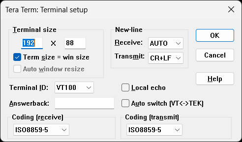
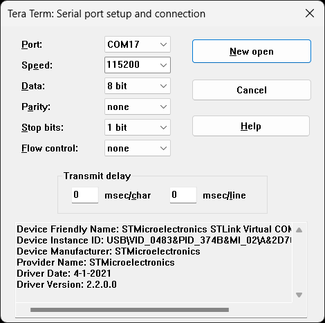

# Tera Term
[Tera Term](https://teratermproject.github.io/index-en.html) is a Windows terminal program which supports serial ports.

## Installation and configuration
Download the [latest release](https://github.com/TeraTermProject/teraterm/releases) and install the application. After installation start the application and select **Setup -> Terminal...**

Setup the newline parameters as per this image:

Plug in the NUCLEO board and configure the serial port as follows through the **Setup -> Serial port...** (The port number depends upon the USB enumeration):

